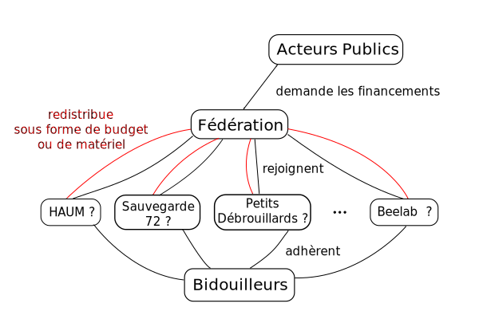

:data-transition-duration: 1000
:skip-help: true
:css: css/style.css

.. role:: contact
.. role:: definition
.. role:: attention

----

:id: title

Post-summer RSync
=================

A fablab's tale
---------------

Mathieu Gaborit

----

Qui c'est celui là ?
--------------------

Mathieu Gaborit (aka. matael)

:contact:`@matael`
:contact:`mathieu@matael.org`
:contact:`blog.matael.org`

Etudiant à l'Université du Maine,

Co-fondateur du *HAUM* (Hackerspace au Mans)

Ex-agent territorial d'une saison... en charge du fablab de la CCI Le Mans-Sarthe

----

:id: base

Point de Base
=============

----

Il était une fois le HAUM
-------------------------

- initiative lancée il y a 3 ans par des étudiants
- association créée il y a 2 ans environ
- débuts difficiles, mais ça va mieux

Aujourd'hui...
--------------

- occupation des locaux d'un hypothétique fablab
- collaboration avec Makershop et la Ruche Numérique
- commence à tendre vers les objectifs initiaux

----

Il était une fois la Ruche
--------------------------

- initiative CCI Le Mans-Sarthe
- projet initié sous forme de Jellys
- ouverture en avril 2013
- espace de coworking & pépinière
- réseautage et travail "collaboratif"

----

:id: grandir
     
Besoin de grandir
=================

----

Comment ?
---------

.. note::

    Seul retenu en PdL : IRT Jules Verne avec le Technocampus en partenaire

- réponse à l'appel à projet sur les Fablab en juin 2013
- achat d'une imprimante 3D en kit début 2014 pour commencer à rassembler des acteurs
- participation de la Ruche à l'initiative French Tech (ex-Quartiers Numériques)
- communication et présence concernant le développement du numérique en Sarthe

----

:attention:`Verbiage Pompeux`

La naissance du projet Fablab
-----------------------------

- le projet piétinne ? on crée un poste CDD.

Objectifs :

- écrire le dossier concernant le fablab
- évaluer les possibilités de financement
- écrire la feuille de route pour le développement du lab
- évaluer les besoins matériels
- identifier les acteurs

----

:id: structure

Un projet, un dossier, deux assos
---------------------------------

----

Intérêt de la fédération
------------------------

- fourni un cadre légal pour la mise à disposition de matériel
- symbole de partenariat et de mise en réseau qui passe mieux auprès des acteurs publics
- gérée par les associations elles mêmes

----

:id: reseau

Mise en réseau
==============

.. note::

    la dernière partie de la misssion portait sur les partenaires éventuels

----

Partenaires
-----------

Publics
~~~~~~~

- CCI Le Mans-Sarthe
- Ville du Mans
- Conseil Général 72 (timide)

Associatifs
~~~~~~~~~~~

- Petits Débrouillards
- Francas 72

Privés et Ecoles
~~~~~~~~~~~~~~~~

- Centre de Formation SNCF/ Technicampus
- ITEMM (prototypage)
- ENSIM
- ISMANS

.. note:: cohérent avec la création d'une fédération

----

:id: aventure

L'aventure continue...
======================

.. note::

    Beaucoup de choses restent à faire...
    Le projet piétine pour des raisons politiques et budgétaires....
    Plus d'infos bientôt ?

----

:id: thanks

Merci à tous !
==============

.. image:: images/logo.svg
    :width: 400px
